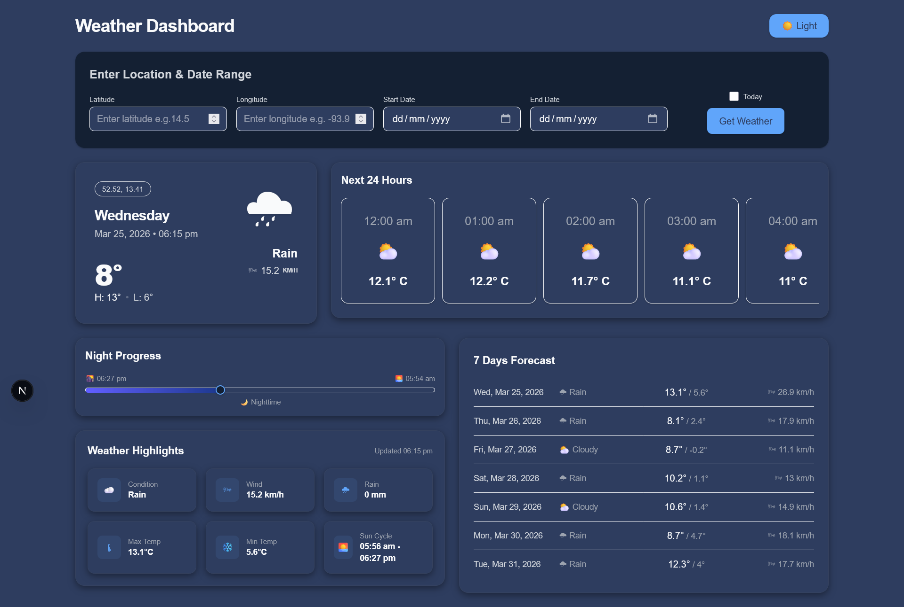
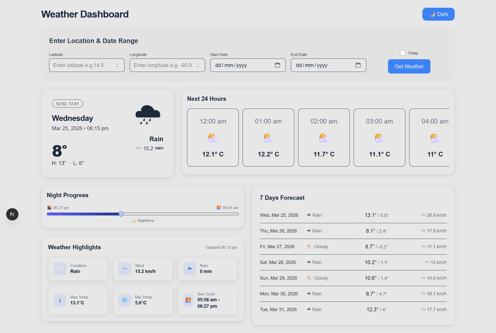

# Weather-Forecast
Lynx Analytics Take Home Assignment - Learning Project by leveraging Open-Meteo API for Weather Forecast Dashboard.

---

## 1. Project Overview

* Weather Forecast Dashboard - Learning project which leverages Open-Meteo API for weather forecast details. 
* Key features -
  - Fetch Weather forecast based on latitude, longitude, start date and end date.
  - Dashboard displays following details:
    1. Today Max, Min temperature
    2. Next 24 hours temperature and weather clouds forecast
    3. Sunrise till sunset timing slider card
    4. Weather Highlights: Condition, Wind speed, Rain, Max Temp., Min Temp., Sun Cycles
    5. 7 Days Forecast/Selected date range forecasts with higher limit to 30 days

---

## 2. Features Implemented

* Search by latitude & longitude
* Date range
* Current weather + hourly + 30 Day Range forecast
* Dark/Light mode
* Responsive design

---

## 3. Requirements Mapping

Example:
* Fetch weather details using Open Meteo API → `useWeather hook` & `weather.api.ts`
* Input Location and Dates Details → `SearchComponent.ts` 
* Display weather data → Dashboard components : Refer `src/app/features/weather/components`
  - Todays Weather Block - `TodaysWeatherBlock.ts`
  - Hourly Weather Details - `HourlyWeather.ts`
  - Sun Cycle : Sunrise till Sunset - `SunCycleSlider.ts`
  - Today's Additional Weather details - `WeatherParameter.ts`
  - Date Range Forecast weather details - `ForecastWeatherDays.ts`
* Dashboard Page Structure Design- `WeatherDashboard.ts`

---

## 4. API Integration

* Open Meteo overview: Open meteo weather forecast api is used as per documentation. It provides weather details in following categories: Hourly, Daily, Current Weather. There are other granular level details. Project dashboard is kept within scope for 3 categories mentioned.
* Params used (`current`, `hourly`, `daily`)
* How query params are built: Helper function is created for converting array based params [as URLSearchParam takes only dictionary key-value]. Refer `src/app/utils/api.utils.ts`: `buildQueryParams`
* Error handling: Error handling is added into service `weather.api.ts`. 

---

## 5. Architecture & Folder Structure
```
src/
└── app/
├── features/
│ └── weather/
│   ├── components/
│   │ ├── ForecastWeatherDays.tsx
│   │ ├── HourlyWeather.tsx
│   │ ├── SearchComponent.tsx
│   │ ├── SunCycleSlider.tsx
│   │ ├── TodaysWeatherBlock.tsx
│   │ └── WeatherParameters.tsx
│   ├── hooks/
│   │ └── useWeather.ts
│   ├── services/
│   │ └── weather.api.ts
│   └── WeatherDashboard.tsx
│
├── shared-components/
│ ├── ErrorState.tsx
│ └── Loader.tsx
│
├── types/
│ └── weather.types.ts
│
├── utils/
│ ├── api.utils.ts
│ ├── datetime.utils.ts
│ └── weather.utils.ts
│
├── favicon.ico
├── globals.css
├── layout.tsx
├── page.tsx
│
├── .gitignore
├── eslint.config.mjs
├── next-env.d.ts
├── next.config.ts
├── package-lock.json
└── package.json
```

Architecture Decision:
1. Modular monilithic achitecture practices are being followed with shared resources.
2. feature/weather is specifically used for building weather related UI components, API services, custom hooks. New features onto dashboard could be added by creating features/[NAME]. This would provide a way to add new futures without touching existing build features. Thereby, maintainability and scalability gets easier.
3. Feature based structuring also allows to work multiple people on different features simultaneously creating no or less merge conflicts. Therby improving productivity.
4. Project level common shared components library folder is created which can be used to placed reusable components across different features. Thereby, improves productivity.
5. All types, interfaces and props are added into feature specific types file. Ensuring feature specific type file provides way to avoid merge conflict. But is also ensures consistency of data types changes across different depending features. e.g. Feature B requiring props or interacting with weather types.
6. Utils is common data processing resusable functions are built.

Key summary: Folder structure is designed with feature based and shared lib approach to ensure better maintainability, better collaboration and scalability as code gets large.

---

## 6. Tech Stack

* React / Next.js: Popular industry standard framework for React projects using NextJS.
* TypeScript: It provide type safety.
* Tailwind CSS: Industry standard for fast and responsive development. 
* Open Meteo API: Weather Forecast API.

---

## 7. Setup Instructions

```bash
git clone https://github.com/DipakAlhate812/weather-forecast.git
npm install
npm run dev
```

---

## 8. Key Design Decisions 

* Why custom hook (`useWeather`): 
  
  It provides an easy way to handle loading, error and useEffect states under the hood. And hence, allows to reuse code wherever api is being called. It is used only once for current project. But as dashboard gets complex, this hook will be useful. Also it makes UI component only focusing on UI Elements creating separation of concerns - i.e. data handling and UI component codes in different files.

  This hook is also created with returning refetch function to make calls based on custom button based events as its not directly possible to call custom hook for button click events which violates the hook rules. 

  ```
      export const useWeather = <T = any>(
      params: WeatherQueryParams,
    ): UseWeatherReturn<T> => {
      const [data, setData] = useState<T | null>(null);
      const [loading, setLoading] = useState(false);
      const [error, setError] = useState<string | null>(null);

      const fetchWeather = useCallback(async () => {
        try {
          setLoading(true);
          setError(null);

          const res = await fetchAPIData(undefined, params);

          if (!res) throw new Error("No data received");

          setData(res);
        } catch (err: any) {
          setError(err.message || "Something went wrong");
        } finally {
          setLoading(false);
        }
      }, [params]);

      useEffect(() => {
        fetchWeather();
      }, [fetchWeather]);

      return { data, loading, error, refetch: fetchWeather };
    };
  ```

* Why feature-based structure:
  
  Feature Folder structure is followed with shared lib approach to ensure better maintainability, better collaboration and scalability as code gets large. 
  
  feature/weather is specifically used for building weather related UI components, API services, custom hooks. 
  
  New features onto dashboard could be added by creating features/[NAME]. 
  
  This would provide a way to add new futures without touching existing build features. Thereby, maintainability and scalability gets easier.

* Why tailwand CSS variables for theming:
  
  Tailwand v4+ with CSS tokens is used. It provides an easy way for creating theme with dark and light. CSS variables allows easy maintainability in terms of upgrading colors and other css tokens making it very quick for adding different themes to the project.

* Why reusable components
  
  Reusable components drastically reduces development time. For current scope, only ErrorState and Loader are added into shared reusable components. But for actual dashboard frontend system shall have standardized resusable components which could be usedd across different modules of dashboard. 

---

---

## 9. Future Improvements

* No caching: Caching could be implemented as dashboard gets bigger and DAU increased to avoid any frontend issues. 
* No geolocation search: Current inputs are based on Latitude and longitude which is not good for user experience. Open Meteo has geolocation API which could be used for Location based inputs for weather forecast.
* No chart visualization: Trend charts could be included for temperature, rain, wind speed, humidity, etc. could be added.
* Why minimal data transformation: Returning API Data looks good in terms of data structuring. But it would be good to have data transformation utils function created which transforms API response into frontend required parameters. That isolates frontend variable dependency on API. Any changes to API response needs changes to be done for utils function. Rest stays same. Thereby, increases productivity and maintainability.

---




